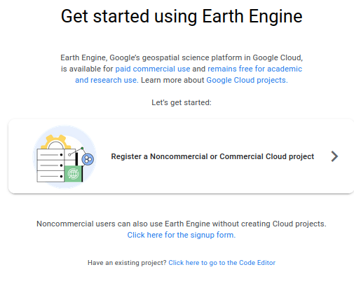
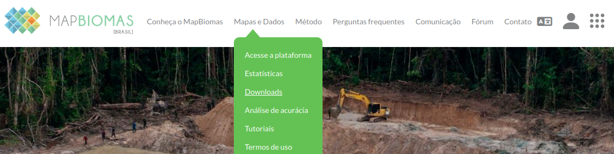
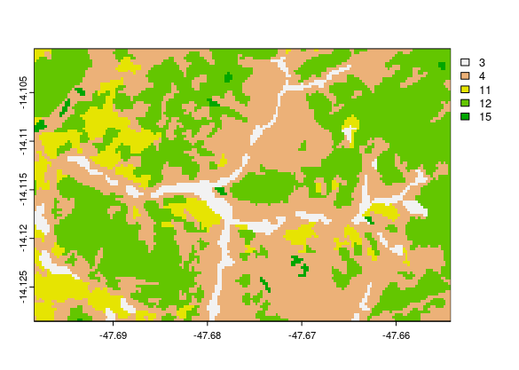
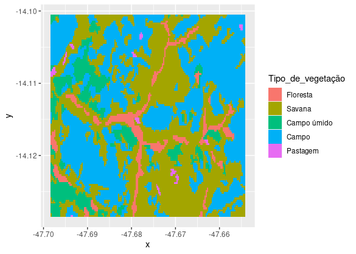
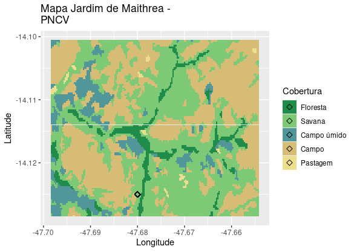
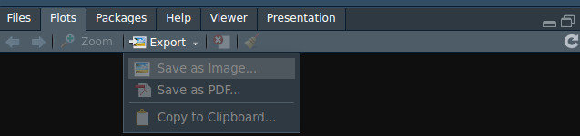

# Como fazer um mapa de cobertura e uso do solo usando os dados da coleção 8 do [Mapbiomas](https://mapbiomas.org/)?

### Marcio B Cure

## tutorialsr

Link <https://mauritia-flexuosa.github.com/tutorialsr)>.

### - Objetivo: Ter em mãos um mapa de cobertura da vegetação para uma área de interesse.

#### - 1º passo : Nós usamos o Google Earth Engine (GEE) para baixar os dados e se você também for usar este método dentre as opções de download, é preciso registrar-se no GEE pelo site <https://code.earthengine.google.com/register>.



#### - 2º passo: Pegar os dados da Coleção 8 do Mapbiomas: <https://brasil.mapbiomas.org/colecoes-mapbiomas/>.

Vá em `Mapas e Dados` e clique em `Downloads`.



Selecione o `Mapas das Coleções`. Nesta página há diversas informações
e você também tem cinco opções de formas de baixar os
dados. Além disso ainda há links para outras coleções do Mapbiomas.


Neste tutorial, usamos o _Toolkit_ do Mapbiomas no Google Earth Engine
(GEE) para baixar os dados. Este método envia os dados direto para o
Google Drive do usuário. Para baixar através do GEE, use o link de
acesso ao [Toolkit do
Mapbiomas](https://code.earthengine.google.com/32769583bb84490cec49b011f566a09b?accept_repo=users%2Fmapbiomas%2Fuser-toolkit).

#### - Observação: O link para a [legenda do mapbiomas](https://brasil.mapbiomas.org/wp-content/uploads/sites/4/2023/08/Legenda-Colecao-8-LEGEND-CODE-1.pdf) também está disponível na página `Mapas e Coleções`.

### Início do script

Primeiro, você precisa carregar pacotes necessários.

```{r echo=TRUE, include=TRUE}
library(tidyverse)
library(terra)
```

## 1. Carregar os dados

Para começar, precisamos carregar os dados a partir do diretório onde
o arquivo \`.tif\` está armazenado.

```{r echo=TRUE, message=FALSE, warning=FALSE}
mb8 <- rast("/home/mcure/Documents/mapbiomas/mapbiomas-brazil-collection-80-parquenacionaldachapadadosveadeiros-2022.tif")
```

## 2. Manipular os dados

Então, prosseguimos definindo uma área de interesse (\`e\`) retangular
com base nas coordenadas dos vértices: xmin, xmax, ymin e ymax.

```{r echo=TRUE, message=FALSE, warning=FALSE}
e <- ext(-47.698479618452235, -47.65407925834481,
-14.128625804871116, -14.100489679244411)
```

Agora precisamos cortar o raster para a região de interesse
previamente definida.

```{r echo=TRUE, message=FALSE, warning=FALSE}
mb8_cortado <- crop(mb8, e)
```

## 3. Fazer um mapa de cobertura da vegetação

Pronto, já podemos fazer um mapa. Aqui está uma forma de fazer mapa
simples, porém as categorias não estão nomeadas e olhando para o mapa não
sabemos o que significam os números correspondentes às cores.

```{r echo=TRUE, include=FALSE, message=FALSE, warning=FALSE}
plot(mb8_cortado) 
```



#### Inserindo detalhes:

Para resolver esse problema, vamos definir as categorias e nomear cada
uma de acordo com a [legenda do
site](https://brasil.mapbiomas.org/wp-content/uploads/sites/4/2023/08/Legenda-Colecao-8-LEGEND-CODE-1.pdf)
do Mapbiomas. Por exemplo, `3` é *floresta*, `4` é *savana* e assim
por diante.

```{r echo=TRUE, message=FALSE, warning=FALSE}
categorias <- mb8_cortado$classification_2022 %>% unique %>%
rename(categorias = classification_2022) %>%
add_column(Tipo_de_vegetação = c("Floresta", "Savana", "Campo úmido",
"Campo", "Pastagem"))

levels(mb8_cortado) <- categorias
```

Agora, vamos passar as informações do raster para um data.frame,
inclusive as coordenadas.

```{r echo=TRUE, message=FALSE, warning=FALSE}
mb8c_df <- as.data.frame(x = mb8_cortado, xy = T)
```

A partir daí, vamos fazer um mapa simples com poucas linhas de comando
usando o pacote `ggplot2`.

```{r echo=TRUE, include=FALSE, message=FALSE, warning=FALSE}
mb8c_df %>% ggplot(aes(x = x, y = y, fill = Tipo_de_vegetação))+
geom_tile()
```



## 4. Customizar o mapa

Podemos melhorar este mapa e personalizá-lo. O pacote \`ggplot2\` faz
belas figuras de uma forma simples e intuitiva. Nas próximas linhas de
comando, vamos redefinir as cores dos tipos de vegetação de acordo com
a legenda do mapbiomas e ajustar outros parâmetros para deixar o mapa
mais bonito.

-   `scale_fill_manual`: Definir cores

-   `labs`: Nome dos eixos, legenda e título

-   `geom_point`: Adicionar um ponto

```{r echo=TRUE, include=TRUE, message=FALSE, warning=FALSE}
mapa <- mb8c_df %>% ggplot(aes(x = x, y = y, fill = Tipo_de_vegetação))+
geom_tile()+ scale_fill_manual(values = c("#1f8d49", "#7dc975",
"#519799", "#d6bc74", "#edde8e"))+ labs(x = "Longitude", y=
"Latitude", fill = "Cobertura", title = "Mapa Jardim de Maithrea -
PNCV")+ geom_point(x = -47.68, y = -14.125, size = 2, shape = 5)

```



## 5. Baixar a figura

Está pronto mapa. Se você quiser salvar, basta executar as linhas
abaixo e salvar no diretório de trabalho.

    png("mapa.png")
    mapa
    dev.off()

Como outra opção de salvamento (como é mostrado no vídeo), você pode
clicar em \`Export\` no RStudio.



Qualquer dúvida ou sugestão, entre em contato com
[marciocure\@gmail.com](mailto:marciocure@gmail.com){.email}.
